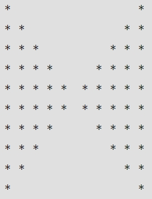
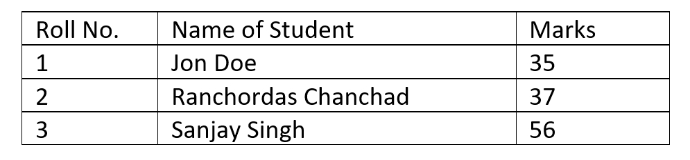
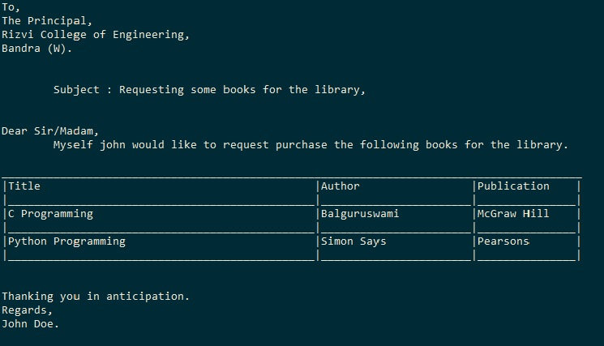
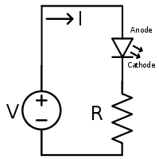
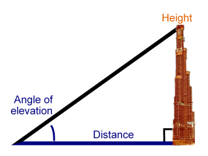

# C Programming

## List of Programs

1. WAP to print your name on screen. [Task Details](https://rizvicoe.github.io/cptasks/week1.html#/1)
2. WAP to print the following pattern using printf. [Task Details](https://rizvicoe.github.io/cptasks/week1.html#/2)

    
3. WAP to print the following table using printf without using loops. [Task Details](https://rizvicoe.github.io/cptasks/week1.html#/3)

    
4. __[ Exp 1 ] WAP to print a letter as shown below using escape sequences.__ [Task Details](https://rizvicoe.github.io/cptasks/week1.html#/4)
    
5. WAP to calculate the area of square. [Task Details](https://rizvicoe.github.io/cptasks/week2.html#/1)
6. __[ Exp 2 ] WAP to calculate the simple interest taking principal,rate of interest and no. of years as inputs from user.__ [Task Details](https://rizvicoe.github.io/cptasks/week2.html#/2)
7. __[ Exp 3 ] WAP to calculate the sum and average of three numbers.__ [Task Details](https://rizvicoe.github.io/cptasks/week2.html#/3)
8. __[ Exp 4 ] WAP to calculate perimeter and area of a circle with the help of constants.__ [Task Details](https://rizvicoe.github.io/cptasks/week2.html#/4)
9. WAP to calculate the resistance required (R) to be connected in series with the LED to protect it from blowing up when Voltage (V) is applied. [Task Details](https://rizvicoe.github.io/cptasks/week2.html#/5)
    
    
10. WAP to calculate the gross salary of the employee given the basic salary. Travelling Allowance, Dearness Allowance and Home Rental Allowance is 20%, 80% and 15% of Basic Salary respectively. [Task Details](https://rizvicoe.github.io/cptasks/week3.html#/1)
11. __[ Exp 5A ] WAP to swap two numbers with the help of a Temporary Number.__ [Task Details](https://rizvicoe.github.io/cptasks/week3.html#/2)
12. __[ Exp 5B ] WAP to swap two numbers without the help of a Temporary Number.__ [Task Details](https://rizvicoe.github.io/cptasks/week3.html#/3)
13. WAP to check if the number is even or not using conditional operator. [Task Details](https://rizvicoe.github.io/cptasks/week3.html#/4)
14. __[ Exp 6 ] WAP to find the greatest number amongst three entered numbers using conditional operator.__  [Task Details](https://rizvicoe.github.io/cptasks/week3.html#/5)
15. WAP to find sum of two integers without using ‘+’ operator. [Task Details](https://rizvicoe.github.io/cptasks/week3.html#/6)
16. Write an algorithm and program to find if the entered character is a vovel or not. [Task Details](https://rizvicoe.github.io/cptasks/week4.html#/1)
17. Draw a flowchart and program to convert a lower case character to uppercase and vise-versa. [Task Details](https://rizvicoe.github.io/cptasks/week4.html#/2) 
18. WAP to check if the year entered is a leap year or not.__ [Task Details](https://rizvicoe.github.io/cptasks/week4.html#/4)
19. WAP to find the body mass index of the user when user enters height and weight. Also find the BMI category to which the user belongs with elseif ladder.__ [Task Details](https://rizvicoe.github.io/cptasks/week4.html#/5) BMI Categories:
    - Underweight = <18.5
    - Normal weight = 18.5–24.9
    - Overweight = 25–29.9
    - Obesity = BMI of 30 or greater
20. WAP to read three integer values from the keyboard and displays the output stating that they are sides of right angled triangle or not. [Task Details](https://rizvicoe.github.io/cptasks/week3.html#/6)
21. WAP to find the roots of the quadratic equation with real roots using math library. [Task Details](https://rizvicoe.github.io/cptasks/week4.html#/3) 
22. WAP to read weekday number and print weekday name using switch.
23. WAP to design calculator with basic operations using switch.
24. Modify the previous program to run repeatedly along with a exit condition using goto.
25. WAP to find the height of the building when the user enters the distance from the building and the angle of elevation in degrees.

26. WAP to print all the odd numbers between 0 and a number entered by the user. Also display the sum of these numbers.
27. WAP to convert binary to decimal number.
28. WAP to display patterns.
29. WAP to reverse a given number.
30. WAP to print fibonanci series.
31. To find the sum of digits of the entered number.
32. To concatenate two strings.
33. To search a number in the user entered numbers.
34. To find the smallest , largest, sum and average of the array of numbers.
35. To check if the string is palindrome
36. To display the marks of the students with roll number and name using structures.
37. To count the number of vowels, consonants, digits and spaces.

## Syllabus
- Module 1
    -  Introduction
        -   Introduction to components of a Computer System
        -   Introduction to Algorithm and Flowchart
    -  Fundamentals of C Programming 
        -   Keywords, Identifiers, Constants and Variables
        -   Data types in C
        -   Operators in C
        -   Basic Input and Output Operations
        -   Expressions and Precedence of Operators
        -   In-built Functions 
- Module 2
    -   Control Structures
        -   Introduction to Control Structures
    -   Branching and looping structures
        -   If statement, If-else statement, Nested if-else, else-if Ladder
        -   Switch statement
        -   For loop, While loop
- Module 3
    -   Functions
        -   Introduction to functions
        -   Function prototype, Function definition, Accessing a function and
parameter passing.
        -   Recursion.
- Module 4
    -   Arrays and Strings
        -   Introduction to Arrays
        -   Declaration and initialization of one dimensional and two-dimensional
arrays.
        -   Definition and initialization of String
        -   String functions 
-   Module 5
    -   Structure and Union
        -   Concept of Structure and Union
        -   Declaration and Initialization of structure and union
        -   Nested structures
        -   Array of Structures
        -   Passing structure to functions
-   Module 6
    -   Pointers 
        -   Fundamentals of pointers
        -   Declaration, initialization and dereferencing of pointers
        -   Operations on Pointers
        -   Concept of dynamic memory allocation

## Sections of a C Program
```c
\\ Comments

\\ Preprocessor Directives

\\ Globals & Constants

\\ Main Function

\\ User defined Functions

```

## C Compilers
-   GNU GCC [(Link 1)](https://gcc.gnu.org/) [(Link for Windows - Mingw)](https://sourceforge.net/projects/mingw/files/Installer/mingw-get-setup.exe/download)
-   Tiny C Compiler [(Link)](https://bellard.org/tcc/)
-   Portable C Compiler [(Link)](http://pcc.ludd.ltu.se/)
-   CLang [(Link)](http://releases.llvm.org/download.html)
-   Digital Mars Compiler [(Link)](https://digitalmars.com/download/freecompiler.html)


## IDE for C Programming
-   CodeBlocks [(http://www.codeblocks.org/)](http://www.codeblocks.org/)
-   Bloodshed Dev C++ [(https://www.bloodshed.net)](https://www.bloodshed.net/devcpp.html)
-   Notepad++ [(https://notepad-plus-plus.org)](https://notepad-plus-plus.org/downloads/) [(Use NppExec Plugin with Gcc Compiler)](https://gist.github.com/softon/0e4d48eb72119607d003c88197daa6d5)
-   Visual Studio Comunity Edition [(Link)](https://visualstudio.microsoft.com/vs/features/cplusplus/)
-   Turbo C++ [(Link to Website)](https://developerinsider.co/download-turbo-c-for-windows-7-8-8-1-and-windows-10-32-64-bit-full-screen/)

## GCC Compiler Parameters
-   -o name = Set the name of the output file eg: -o test.exe
-   -E  =   Used to return the preprocessor output (.i extention)
-   -S  =   Used to return assembly code  (.s extension)
-   -C  =   Used to create the object file (.o extension)
-   -save-temps =   To generate all the intermediate files during compilation.
-   -ansi   =   To enable the ANSI standard
-   -std=c89|c99|c9x = To change the standard
-   -pedantic-errors = Strict conformance to ISO standards
-   -Wall = Show errors and warnings

## Links
-   List of C Programs [(https://www.faceprep.in/c-programming-questions/)](https://www.faceprep.in/c-programming-questions/)
-   List of C Programs Link 2 [(https://www.studytonight.com/c/programs/)](https://www.studytonight.com/c/programs/)

## C Program Structure (Basic)
```
/*
    Aim: ...
    Author: ...
    Class: ...
*/

#include <stdio.h>

int main ()
{
    // Your code starts here


    return 0;
}

```

## C Program Structure (Advanced)
```
/* Documentation */
/*
    Aim: ...
    Author: ...
    Class: ...
*/

/* Libraries */
#include <stdio.h>

/* Function Declarations */
int example(int x);

/* Global Variables & Constants */
int x = 100;
#define PI 3.142 

/* Main Function */
int main ()
{
    // Your code starts here


    return 0;
}

/* Function Definitions */
int example(int x){

}

```